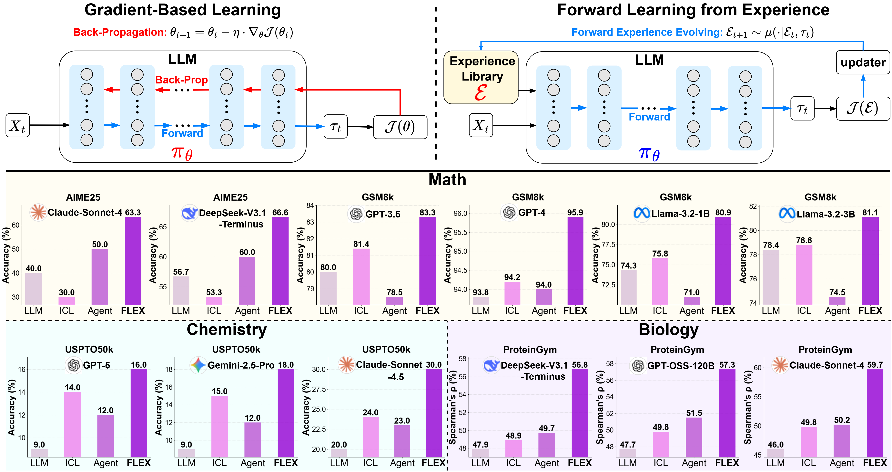
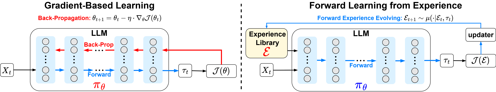

<div align="center">
    <table style="width: 100%; border: none;">
        <tr>
            <td align="left" style="width: 50%; border: none;">
                
            </td>
            <td align="right" style="width: 50%; border: none;">
                
                
            </td>
        </tr>
    </table>
</div>

---

<div align="center">

# FLEX: Inheritable Intelligence via Forward Learning from Scaling Experience

[](https://arxiv.org/abs/2511.06449)

</div>

The official codebase for our paper, FLEX: Inheritable Intelligence via Forward Learning from Scaling Experience.

---

## 🔥 News

- **[2025/11]** We release our paper on arXiv! Check out [FLEX: Inheritable Intelligence via Forward Learning from Scaling Experience](https://arxiv.org/abs/2511.06449).
<!-- - **[2025/11]** Code, datasets, and trained experience libraries are now available! -->

---

## Introduction
Welcome to **F**orward **L**earning from **Ex**perience (FLEX), a novel learning paradigm that shifts learning from modifying model parameters to constructing and leveraging an evolvable experience library.
By continuously expanding and refining this library, agents can progressively acquire deeper insights and knowledge, enhancing their cognitive capabilities with accumulated experiences.

We conduct extensive experiments across diverse challenging scientific domains, including Olympiad-level mathematics (AIME25), chemical retrosynthesis (USPTO50k), and protein fitness prediction (ProteinGym). FLEX demonstrates substantial and consistent improvements on these tasks, from 40\% to 63\% on AIME25 and 20\% to 30\% on USPTO50k, exhibiting great enhancement in the capacity of reasoning and knowledge leverage.



The following picture exhibits the differences between gradient-based learning and FLEX, highlighting the interaction among the actor $\pi$, updater $\mu$, and experience library $\mathcal{E}$ of FLEX.



We have also discovered **two exciting features** of FLEX:
1. **The scaling law** for the experience library: agent performance scales predictably with accumulated knowledge and revealing a path towards a collaborative experience ecosystem.
2. **Intelligence Inheritance**: Distilled experience can be transferred between agents in a plug-and-play manner, enabling instant knowledge assimilation and bypassing redundant learning

## Getting Started
We are very eager to open-source our code. However, it is currently undergoing a company-level review process at ByteDance, which may take some time (potentially a few months). We will release the code immediately once the approval is granted. Stay tuned!

## Citation

If you use FLEX in your research, please cite our paper:

```bibtex
@misc{cai2025flexcontinuousagentevolution,
      title={FLEX: Continuous Agent Evolution via Forward Learning from Experience}, 
      author={Zhicheng Cai and Xinyuan Guo and Yu Pei and JiangTao Feng and Jiangjie Chen and Ya-Qin Zhang and Wei-Ying Ma and Mingxuan Wang and Hao Zhou},
      year={2025},
      eprint={2511.06449},
      archivePrefix={arXiv},
      primaryClass={cs.LG},
      url={https://arxiv.org/abs/2511.06449}, 
}
```

